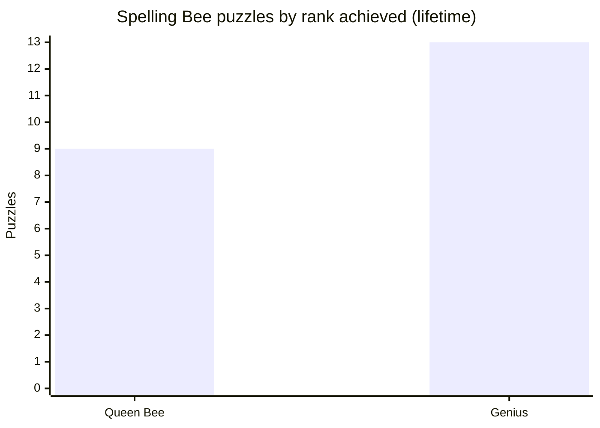

# nyt-suite-solver

Algorithms that solve the daily New York Times puzzle suite and log how
effectively each puzzle was solved. It runs every day on its own via GitHub
Actions, with no server required, and can also be used interactively or
headlessly.

## Games & solvers

| Game | Approach | Word source |
|------|----------|-------------|
| Letter Boxed | Trie-backed search for 1 or 2 word solutions covering all sides | `wordlist_small.txt` |
| Spelling Bee | Trie word search, scored to a rank (Beginner to Queen Bee) | `wordlist.txt` |
| Sudoku | Donald Knuth's Dancing Links / Algorithm X exact cover (C++) | scraped board |

All solvers are **fully algorithmic, with no AI or LLM calls.** Puzzles are
scraped from the NYT site and results are written to `solutions/<game>/`.

<!-- STATS:START -->
## Lifetime results

_Auto-generated from `solutions/` · **43** puzzles solved across 3 games (through 2026-07-21)._

| Game | Puzzles | Lifetime performance |
| --- | ---: | --- |
| Spelling Bee | 33 | avg score **98.0%** · Queen Bee on **41%** of puzzles |
| Letter Boxed | 3 | avg **24.7** valid solutions · **100%** solved |
| Sudoku | 7 | **100%** solved · avg **0.24 ms** |


<!-- STATS:END -->

The results above refresh automatically: a scheduled GitHub Actions workflow
solves every game each morning and commits the new results, so this page stays
up to date with no hosted service.

## Running it yourself

The `make` targets create an isolated virtualenv on first run, so nothing
touches your system Python.

Interactive terminal UI:
```
make run
```

Solve headlessly (all games today, a specific Spelling Bee date, or a backfill):
```
.venv/bin/python src/cli.py
.venv/bin/python src/cli.py --game spelling-bee --date 2026-07-20
.venv/bin/python src/cli.py --game spelling-bee --backfill
```
