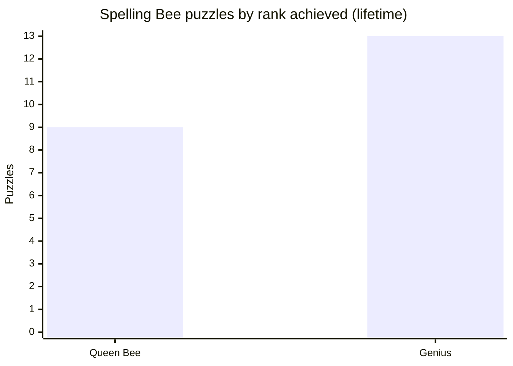

# nyt-suite-solver

Algorithms that solve the daily New York Times puzzle suite and log how
effectively each puzzle was solved. It runs every day on its own via GitHub
Actions — no server required — and can also be used interactively or headlessly.

## Games & solvers

| Game | Approach | Word source |
|------|----------|-------------|
| Letter Boxed | Trie-backed search for 1–2 word solutions covering all sides | `wordlist_small.txt` |
| Spelling Bee | Trie word search, scored to a rank (Beginner → Queen Bee) | `wordlist.txt` |
| Sudoku | Donald Knuth's Dancing Links / Algorithm X exact cover (C++) | scraped board |

All solvers are **fully algorithmic — no AI/LLM calls.** Puzzles are scraped from
the NYT site (`window.gameData`) and results are written to `solutions/<game>/`.

<!-- STATS:START -->
## Lifetime results

_Auto-generated from `solutions/` · **43** puzzles solved across 3 games (through 2026-07-21)._

| Game | Puzzles | Lifetime performance |
| --- | ---: | --- |
| Spelling Bee | 33 | avg score **98.0%** · Queen Bee on **41%** of puzzles |
| Letter Boxed | 3 | avg **24.7** valid solutions · **100%** solved |
| Sudoku | 7 | **100%** solved · avg **0.24 ms** |


<!-- STATS:END -->

## Design philosophy

See [`CLAUDE.md`](CLAUDE.md) for the full rationale. In short:

1. **Assess realistic human solving.** Solvers use a local human-realistic
   wordlist and use NYT's official answer/dictionary lists only to score and
   validate — never to solve. (Solving from the answer list would trivially win
   and measure nothing.)
2. **Prefer deterministic algorithms over AI.** Reach for an LLM only for a
   puzzle that genuinely can't be solved otherwise (e.g. a future Crossword).
3. **Solvers stay pure and headless**, decoupled from the interactive TUI.

## Usage

The `make` targets create and use an isolated virtualenv (`.venv`) on first run
and install dependencies there, so nothing touches your system Python.

Interactive terminal UI (arrow-key menus):
```
make run
```

Run the offline test suite:
```
make test
```

Headless — used by the daily automation, and for backfilling. Run through the
venv (created by `make setup`):
```
.venv/bin/python src/cli.py                                # all games, today
.venv/bin/python src/cli.py --game spelling-bee --date 2026-07-20
.venv/bin/python src/cli.py --game sudoku --difficulty hard
.venv/bin/python src/cli.py --game spelling-bee --backfill # every archived date
```

> On macOS the interactive TUI needs Accessibility permission for your terminal
> (pynput's global key listener). The headless CLI has no such requirement.

## Output & stats

Each solved puzzle writes a JSON file under `solutions/<game>/` capturing the
puzzle, the solution(s), and performance metrics:

- **Spelling Bee**: `score`, `percentage`, `rank`, `pangrams`, `missed_answers`, `solve_time`
- **Letter Boxed**: `valid_answers`, `invalid_answers`, `shortest_answer_length`, `solve_time`
- **Sudoku**: `input_puzzle`, `solved_puzzle`, `solve_time`

Lifetime aggregates across all runs are surfaced in the
**[Lifetime results](#lifetime-results)** section above, which `src/stats.py`
regenerates from these JSON files. The daily workflow refreshes it on every run,
so the repo's front page stays up to date with no hosted service. Regenerate
locally with `make stats`.

## Automation

- **`.github/workflows/daily.yml`** — solves every game each morning and commits
  the results, so puzzles are solved and logged daily with no server.
- **`.github/workflows/tests.yml`** — runs the unit tests on every push and PR.

## Data availability

NYT only serves today's puzzle for Letter Boxed and Sudoku, so those accumulate
going forward. Spelling Bee exposes a ~1-week public archive (captured by
`--backfill`); deeper history requires a logged-in subscription session.

## Project layout

- `src/solvers/<game>/` — solver classes (pure logic + scraping)
- `src/solvers/scraping.py`, `src/solvers/BaseSolver.py` — shared helpers
- `src/cli.py` — headless entrypoint
- `src/main.py`, `src/menus.py`, `src/game_runner.py` — interactive TUI
- `tests/` — offline pytest suite

## Milestones

- [X] Letter Boxed — solver + daily upload
- [X] Spelling Bee — solver + daily upload + archive backfill
- [X] Sudoku — solver + daily upload
- [X] Stat tracking (per-puzzle)
- [X] Daily automation (GitHub Actions cron)
- [X] Auto-updating stats in the README (no hosted UI)
