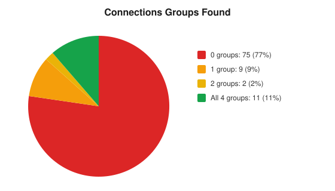
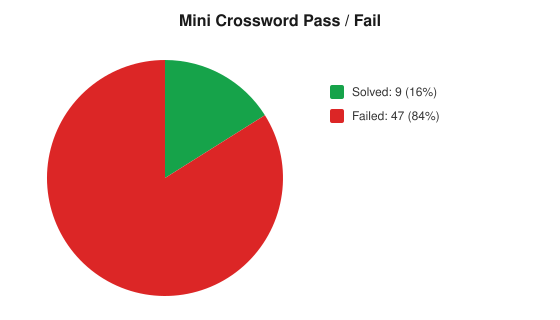

# nyt-suite-solver

Algorithms that solve the daily New York Times puzzle suite and log how
effectively each puzzle was solved. Solvers are algorithmic wherever possible
(no AI); the two games with no clean algorithm, Connections and the Mini
crossword, use an LLM, and even the Mini keeps its grid fill deterministic. It
runs every day on its own via GitHub Actions, with no server required, and can
also be used interactively or headlessly.

<!-- STATS:START -->
## Lifetime results

_Auto-generated from `solutions/` · **4339** puzzles solved across 7 games (through 2026-08-29)._

<div align="center">
<table>
<tr><th>Game</th><th>Puzzles</th><th>Avg score</th><th>p90 runtime</th></tr>
<tr><td>Spelling Bee</td><td>48</td><td>97.3%</td><td>107 ms</td></tr>
<tr><td>Letter Boxed</td><td>40</td><td>2.2 words</td><td>1.55 s</td></tr>
<tr><td>Sudoku</td><td>120</td><td>100%</td><td>0.30 ms</td></tr>
<tr><td>Wordle (easy)</td><td>1898</td><td>3.8 guesses</td><td>7.21 s</td></tr>
<tr><td>Wordle (hard)</td><td>1898</td><td>3.9 guesses</td><td>499 ms</td></tr>
<tr><td>Strands</td><td>227</td><td>76% words</td><td>65.35 s</td></tr>
<tr><td>Connections</td><td>69</td><td>12%</td><td>10.18 s</td></tr>
<tr><td>Mini Crossword</td><td>39</td><td>6% cells</td><td>4.90 s</td></tr>
</table>
</div>
<!-- STATS:END -->

The results above refresh automatically: a scheduled GitHub Actions workflow
solves every game each morning and commits the new results, so this page stays
up to date with no hosted service.

## How the solvers work

### Spelling Bee

Spelling Bee shows seven letters, one of them required, and asks for every word
that uses only those letters and includes the required one. The solver loads a
human wordlist into a trie and walks it to collect the valid words and pangrams,
scoring each by length with a bonus for pangrams. That score is compared against
the puzzle's official answer list to produce a percentage and a rank from
Beginner up to Queen Bee. Because it searches a realistic vocabulary rather than
the official answers, the result reflects how well that vocabulary covers each
day's puzzle.

<p align="center"></p>

### Letter Boxed

Letter Boxed puts twelve letters on the four sides of a square and asks you to
spell a chain of words that uses every letter, where each word begins with the
previous word's last letter and no two consecutive letters share a side. The
solver builds a trie of board-legal words from a human wordlist and runs a
depth-first search for the shortest chain that covers all twelve letters.
Candidate solutions are checked against NYT's accepted dictionary. Because only
the *shortest* chain is scored, the search is iteratively deepened — it looks for
a one-word solution, then two, and so on up to four — and stops at the first
depth that yields an accepted answer. Each extra word multiplies the search space
by roughly a hundred, so this keeps the common two-word day as fast as it ever
was while still cracking the rare board that needs a third word. A board the
wordlist cannot solve within the time budget is recorded as unsolved rather than
being padded with answers borrowed from NYT. The chart below breaks the boards
down by how many words their shortest solution needed.

<p align="center"></p>

### Sudoku

Sudoku is treated as an exact-cover problem and solved with Donald Knuth's
Algorithm X using the Dancing Links technique, written as a C++ extension. Every
cell, row, column, and box rule becomes a column in a sparse matrix of
doubly-linked nodes, and the algorithm repeatedly covers the most-constrained
column and backtracks until each rule is satisfied exactly once. It finds the
unique solution in well under a millisecond on every difficulty, so there is no
chart here; the p90 runtime above tells the whole story.

### Wordle

Wordle gives six tries to guess a hidden five-letter word. The solver treats each
turn as an information-theory question: it scores every candidate by the expected
information (Shannon entropy) its feedback would reveal and plays the guess that,
on average, eliminates the most remaining words. The opening guess is therefore
the same every day (`tares`, the highest-entropy word in the vocabulary), after
which it recomputes the best next guess from the feedback so far. Two modes are
tracked: **hard** may only guess words still consistent with every clue, while
**easy** may play any word (even one it knows cannot be the answer) purely to
extract more information, so it tends to solve in fewer guesses. Like the other
games it plays from a human vocabulary, not the official answer list, and the
chart compares how many guesses each mode needs (X marks a miss).

<p align="center"></p>

### Strands

Strands hides a set of theme words plus a spanning "spangram" in a 6x8 grid,
where the answers tile the board so every letter is used exactly once. There is
no theme understanding here at all: the solver treats it as a pure exact-cover
puzzle, finding every valid word-path (king moves) from a human wordlist and
searching for ways to partition all 48 cells into a few long words with one path
spanning opposite sides. It keeps every candidate partition and counts a puzzle
as solved when one of them recovers all the theme words. It will not crack every
board (English offers many valid tilings, and spangrams are usually multi-word
phrases we cannot match as a single word), but getting some without any AI is the
fun of it.

<p align="center"></p>

### Connections

Connections splits 16 words into 4 hidden groups joined by wordplay, trivia, or a
shared prefix, which has no clean algorithm, so this is a deliberate LLM solver.
It never sees the answer key while solving: the model reasons over the whole board
and proposes the full split ordered by confidence, and the solver guesses the
surest group first. A clean solve costs a single request; after any wrong guess it
re-plans with the real "one away" and wrong-guess feedback, and it never repeats a
guess, until it wins or spends its four mistakes. It runs on a free LLM provider
(Groq, GitHub Models, or Gemini, whichever is configured), so it stays free; if
none is available the game is simply recorded as unsolved. The score reflects
realistic play rather than a trivial win, since a wrong group costs a mistake just
as it would for a person.

<p align="center"></p>

### Mini crossword

The Mini is the project's clearest hybrid: an LLM answers the clues, but a
deterministic search fills the grid, and the two iterate. The model proposes a few
candidate answers per clue (given the full crossing structure); a backtracking
constraint solver tiles the 5x5 so every crossing letter agrees, preferring the
model's answers and using a human wordlist only to fill true gaps. The resulting
grid is then fed back to the model -- "here are the letters the crossings have
locked, revise anything that doesn't fit" -- and the loop repeats until the grid
stops changing. That feedback loop is what lets a clue it got wrong blind fall
into place once a crossing reveals a letter or two. Only today's Mini is free to
fetch (past Minis and the full-size Daily and Sunday crosswords are locked behind
a NYT subscription), so it is solved fresh each day and never backfilled.

<p align="center"></p>

## Running it yourself

The `make` targets create an isolated virtualenv on first run, so nothing
touches your system Python.

Interactive terminal UI:
```
make run
```

Solve headlessly (all games today, a specific date, or a backfill):
```
.venv/bin/python src/cli.py
.venv/bin/python src/cli.py --game spelling-bee --date 2026-07-20
.venv/bin/python src/cli.py --game spelling-bee --backfill
.venv/bin/python src/cli.py --game letter-boxed --backfill --limit 50
```

Letter Boxed, Wordle, Strands and Connections have a full date-addressable
archive; Spelling Bee has a rolling ~1-week window; Sudoku and the Mini are
today-only. Backfills skip dates already on disk, so they are resumable and safe
to re-run. The Letter Boxed archive reaches back to 2019 (~2,750 puzzles) and is
CPU-bound rather than quota-bound — most boards solve in well under a second, but
one with no two-word solution can take a minute — so `--limit` is the practical
way to work through it.

Connections and the Mini crossword call an LLM. The client tries providers in
order and skips any that aren't configured: Groq (`GROQ_API_KEY`, generous free
tier, leads when set), then GitHub Models (the workflow's built-in `GITHUB_TOKEN`
with `models: read`), then Gemini (`GEMINI_API_KEY`). To run them locally, export
one credential, otherwise they record an unsolved result:
```
export GROQ_API_KEY=...     # free tier, console.groq.com (recommended)
# or: export GITHUB_TOKEN=...   # a PAT with the Models permission
# or: export GEMINI_API_KEY=... # only where the Gemini free tier is available
.venv/bin/python src/cli.py --game connections
.venv/bin/python src/cli.py --game crossword
```

Connections has a full free archive, so you can backfill a recent sample to judge
its success rate (capped since each solve is an LLM call; re-run to accumulate
more). The Mini is today-only and cannot be backfilled.
```
.venv/bin/python src/cli.py --game connections --backfill --limit 30
```
