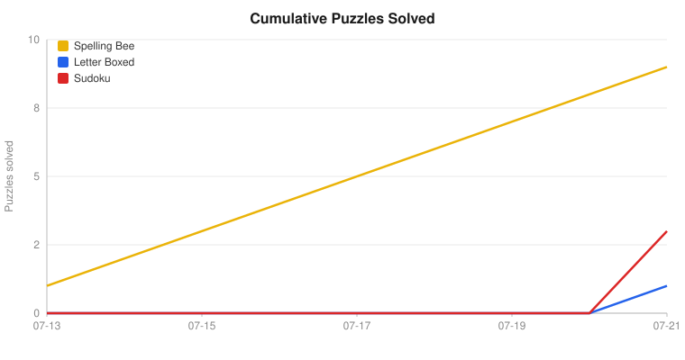
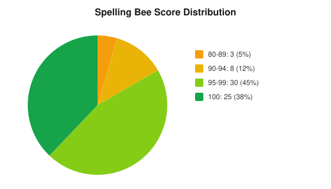
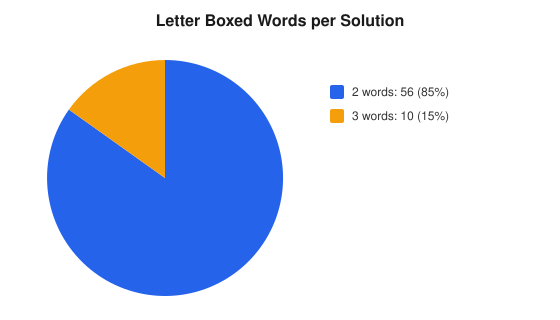
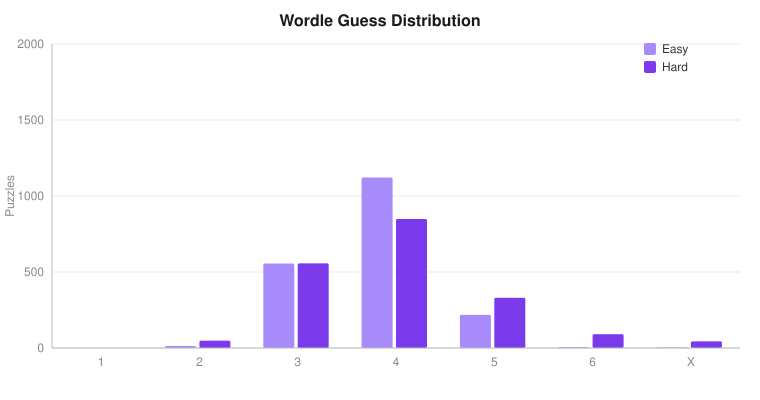
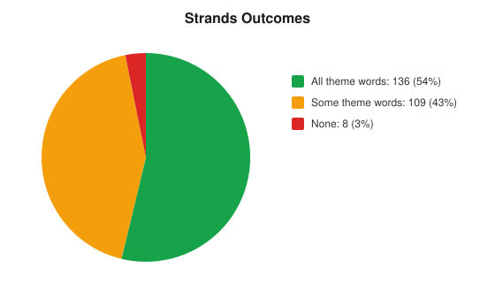

# nyt-suite-solver

Algorithms that solve the daily New York Times puzzle suite and log how
effectively each puzzle was solved. Every solver is a real algorithm with no AI
or LLM calls. It runs every day on its own via GitHub Actions, with no server
required, and can also be used interactively or headlessly.

<!-- STATS:START -->
## Lifetime results

_Auto-generated from `solutions/` · **48** puzzles solved across 5 games (through 2026-07-22)._

| Game | Puzzles | Avg score | p90 runtime |
| --- | ---: | ---: | ---: |
| Spelling Bee | 10 | 99.3% | 92 ms |
| Letter Boxed | 2 | 2.0 words | 155 ms |
| Sudoku | 6 | 100% | 0.23 ms |
| Wordle (easy) | 10 | 3.9 guesses | 2.89 s |
| Wordle (hard) | 10 | 4.1 guesses | 111 ms |
| Strands | 10 | 81% words | 41.11 s |

<p align="center"></p>
<!-- STATS:END -->

The results above refresh automatically: a scheduled GitHub Actions workflow
solves every game each morning and commits the new results, so this page stays
up to date with no hosted service.

## How the solvers work

### Spelling Bee

Spelling Bee shows seven letters, one of them required, and asks for every word
that uses only those letters and includes the required one. The solver loads a
human wordlist into a trie and walks it to collect the valid words and pangrams,
scoring each by length with a bonus for pangrams. That score is compared against
the puzzle's official answer list to produce a percentage and a rank from
Beginner up to Queen Bee. Because it searches a realistic vocabulary rather than
the official answers, the result reflects how well that vocabulary covers each
day's puzzle.

<p align="center"></p>

### Letter Boxed

Letter Boxed puts twelve letters on the four sides of a square and asks you to
spell a chain of words that uses every letter, where each word begins with the
previous word's last letter and no two consecutive letters share a side. The
solver builds a trie of board-legal words from a human wordlist and runs a
depth-first search for the shortest chain, capped at two words, that covers all
twelve letters. Candidate solutions are then checked against NYT's accepted
dictionary. The chart below shows how often the puzzle is solvable in a single
word versus two.

<p align="center"></p>

### Sudoku

Sudoku is treated as an exact-cover problem and solved with Donald Knuth's
Algorithm X using the Dancing Links technique, written as a C++ extension. Every
cell, row, column, and box rule becomes a column in a sparse matrix of
doubly-linked nodes, and the algorithm repeatedly covers the most-constrained
column and backtracks until each rule is satisfied exactly once. It finds the
unique solution in well under a millisecond on every difficulty, so there is no
chart here; the p90 runtime above tells the whole story.

### Wordle

Wordle gives six tries to guess a hidden five-letter word. The solver treats each
turn as an information-theory question: it scores every candidate by the expected
information (Shannon entropy) its feedback would reveal and plays the guess that,
on average, eliminates the most remaining words. The opening guess is therefore
the same every day (`tares`, the highest-entropy word in the vocabulary), after
which it recomputes the best next guess from the feedback so far. Two modes are
tracked: **hard** may only guess words still consistent with every clue, while
**easy** may play any word (even one it knows cannot be the answer) purely to
extract more information, so it tends to solve in fewer guesses. Like the other
games it plays from a human vocabulary, not the official answer list, and the
chart compares how many guesses each mode needs (X marks a miss).

<p align="center"></p>

### Strands

Strands hides a set of theme words plus a spanning "spangram" in a 6x8 grid,
where the answers tile the board so every letter is used exactly once. There is
no theme understanding here at all: the solver treats it as a pure exact-cover
puzzle, finding every valid word-path (king moves) from a human wordlist and
searching for ways to partition all 48 cells into a few long words with one path
spanning opposite sides. It keeps every candidate partition and counts a puzzle
as solved when one of them recovers all the theme words. It will not crack every
board (English offers many valid tilings, and spangrams are usually multi-word
phrases we cannot match as a single word), but getting some without any AI is the
fun of it.

<p align="center"></p>

## Running it yourself

The `make` targets create an isolated virtualenv on first run, so nothing
touches your system Python.

Interactive terminal UI:
```
make run
```

Solve headlessly (all games today, a specific Spelling Bee date, or a backfill):
```
.venv/bin/python src/cli.py
.venv/bin/python src/cli.py --game spelling-bee --date 2026-07-20
.venv/bin/python src/cli.py --game spelling-bee --backfill
```
